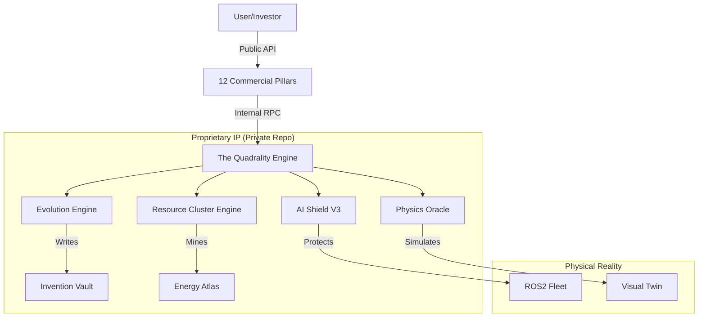

# Empeiria Haus: The Operating System for Matter (INTERNAL MASTER)

> **CONFIDENTIAL: PROPRIETARY SOURCE CODE**
> *This repository contains the full implementation of the Empeiria Haus platform, including the Invention Vault, Quadrality Engine, and unredacted physics kernels.*


## 🔐 Internal Status: PRODUCTION
*   **Version**: v1.0.0 (Grand Unification)
*   **Access Level**: Core Engineering & Strategic Investors Only.
*   **Public Mirror**: [industriverse-public](https://github.com/industriverse/industriverse-public) (Skeletonized)

---

## 🧠 The Core Brain (Private Only)
Unlike the public skeleton, this repository contains the **living intelligence**:

1.  **[Invention Vault](invention_vault/)**: The patent-pending IP core.
    *   *Contains*: `thermodynamic_kernels`, `evolution_strategies`, `market_makers`.
2.  **[Infrastructure](infra/)**: Full Kubernetes & Terraform manifests for the Dyson Sphere.
3.  **[Evolution Engine](src/evolution/)**: The *real* self-optimizing loops (not stubs).
4.  **[The 12 Pillars](src/products/)**: Full implementation of all commercial modules.

---

## 🏛️ System Architecture (Full)


---

## 🛠️ Internal Developer Guide

### 1. Full Installation
```bash
# Install ALL dependencies (including private libs)
pip install -r requirements.txt
npm install
```

### 2. Run the Grand Experiment
To execute the full 30-day evolutionary simulation:
```bash
python3 scripts/demos/generate_investor_package.py
```

### 3. Deploy to Production
```bash
# Deploys the full stack to the private cluster
sh scripts/deployment/deploy_full_stack.sh
```

---

## 📂 Directory Structure (Private)
*   `src/`: Source code for all 12 pillars.
*   `invention_vault/`: **[RESTRICTED]** Patentable algorithms.
*   `docs/`: Full documentation, including investor decks and strategy.
*   `infra/`: Infrastructure as Code (Terraform/K8s).
*   `tests/`: Comprehensive test suite (100+ tests).
*   `tools/`: Internal CLI tools for managing the organism.

---
*Copyright © 2025 Empeiria Haus. All Rights Reserved. UNAUTHORIZED DISTRIBUTION PROHIBITED.*
