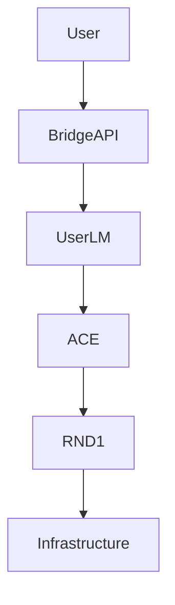

# Trifecta Architecture

## 1. Introduction
The Trifecta is the core AI engine of Industriverse, consisting of three integrated systems:
1. **UserLM-8b**: The personalized interface and behavior model.
2. **RND1-Base-0910**: The resource optimization and defense model.
3. **ACE (Autonomous Cognitive Entity)**: The agentic executor and decision maker.

## 2. Component Architecture

### 2.1 UserLM-8b
- **Role**: Handles user interaction, persona management, and intent understanding.
- **Architecture**: 8B parameter LLM fine-tuned on industrial dialogues.
- **Modules**:
    - `Persona`: Manages user-specific context.
    - `Behavior`: Adapts response style.

### 2.2 RND1-Base-0910
- **Role**: Optimizes resource allocation and defends the system.
- **Architecture**: Large-scale foundation model (61GB).
- **Modules**:
    - `Optimizer`: Solves resource allocation problems.
    - `Resource Defense`: Protects against adversarial attacks.

### 2.3 ACE Agent
- **Role**: Executes tasks and coordinates actions.
- **Architecture**: Agentic framework with memory and planning.
- **Modules**:
    - `Memory Cortex`: Long-term and short-term memory.
    - `Decision Arbiter`: Makes final execution decisions.
    - `Playbook Engine`: Executes predefined workflows.

## 3. Integration Flow

