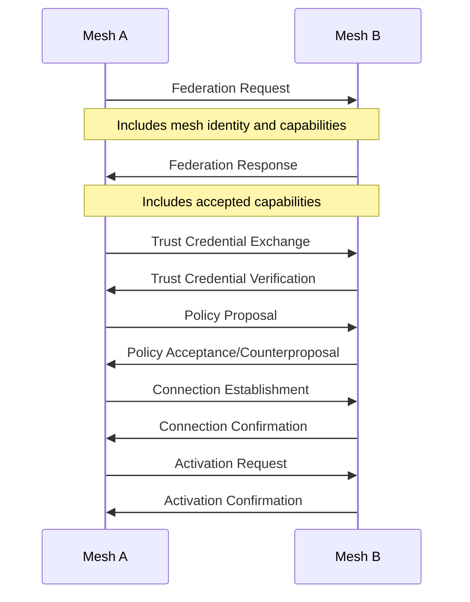

# Cross-Mesh Federation Specification

## Overview

Cross-Mesh Federation enables secure communication and coordination between independent Industriverse protocol meshes. This specification defines the architecture, protocols, and security mechanisms for establishing and maintaining federation relationships between meshes.

## Architecture

### Federation Model

Cross-Mesh Federation follows a decentralized federation model where each mesh maintains its autonomy while establishing trust relationships with other meshes. The federation model supports the following topologies:

1. **Bilateral Federation**: Direct federation between two meshes
2. **Multilateral Federation**: Federation between multiple meshes
3. **Hierarchical Federation**: Federation with parent-child relationships
4. **Mesh-of-Meshes**: Fully connected federation network

### Components

#### Federation Gateway

Each mesh participating in federation must implement a Federation Gateway that serves as the entry and exit point for cross-mesh communication. The Federation Gateway is responsible for:

- Establishing and maintaining federation relationships
- Authenticating and authorizing cross-mesh requests
- Translating between different protocol dialects
- Enforcing federation policies
- Monitoring and logging federation activities

#### Federation Registry

The Federation Registry maintains information about federation relationships, including:

- Federation partners and their capabilities
- Trust certificates and credentials
- Federation policies and agreements
- Federation status and health metrics

#### Federation Broker

The Federation Broker facilitates communication between meshes by:

- Routing messages between federation gateways
- Translating between different message formats
- Implementing store-and-forward capabilities for offline meshes
- Load balancing and failover for high availability

## Federation Protocol

### Handshake Process

The federation handshake process establishes a secure federation relationship between two meshes:

1. **Discovery**: Meshes discover each other through direct configuration or a discovery service
2. **Capability Exchange**: Meshes exchange information about their capabilities and requirements
3. **Trust Establishment**: Meshes exchange and verify trust credentials
4. **Policy Negotiation**: Meshes negotiate federation policies and agreements
5. **Connection Establishment**: Meshes establish secure communication channels
6. **Activation**: Federation relationship becomes active



### Message Routing

Cross-mesh messages are routed through federation gateways using the following process:

1. **Source Routing**: The source mesh determines the destination mesh
2. **Gateway Selection**: The source mesh selects an appropriate federation gateway
3. **Message Wrapping**: The message is wrapped in a federation envelope
4. **Transmission**: The message is transmitted to the destination mesh's federation gateway
5. **Unwrapping**: The destination mesh unwraps the federation envelope
6. **Local Routing**: The message is routed to the appropriate component within the destination mesh


### Federation Envelope

Cross-mesh messages are wrapped in a federation envelope that includes:

```json
{
  "federation": {
    "version": "1.0",
    "id": "fed_1234567890abcdef",
    "timestamp": 1621234567890,
    "source_mesh": {
      "id": "mesh_abc123",
      "gateway_id": "gateway_abc123"
    },
    "destination_mesh": {
      "id": "mesh_def456",
      "gateway_id": "gateway_def456"
    },
    "routing": {
      "path": ["mesh_abc123", "mesh_def456"],
      "ttl": 10,
      "hops": 1,
      "flags": ["reliable", "ordered"]
    },
    "security": {
      "federation_id": "fed_abc123_def456",
      "signature": "base64_encoded_signature",
      "certificate": "base64_encoded_certificate",
      "encryption": {
        "algorithm": "AES-256-GCM",
        "key_id": "key_12345",
        "iv": "base64_encoded_iv"
      }
    },
    "policy": {
      "priority": 2,
      "qos": 1,
      "max_latency": 5000
    },
    "metadata": {
      "content_type": "application/json",
      "content_encoding": "utf-8",
      "schema_id": "schema_12345"
    }
  },
  "message": {
    // Original message
  }
}
```

## Security

### Trust Model

Cross-Mesh Federation uses a decentralized trust model based on the following principles:

1. **Explicit Trust**: Federation relationships must be explicitly established
2. **Mutual Authentication**: Both meshes must authenticate each other
3. **Least Privilege**: Federation relationships grant only the minimum necessary privileges
4. **Transitive Trust**: Trust can be delegated through federation relationships
5. **Revocable Trust**: Trust can be revoked at any time

### Authentication and Authorization

Federation gateways authenticate and authorize cross-mesh requests using:

1. **X.509 Certificates**: For mesh identity and authentication
2. **JWT Tokens**: For authorization and delegation
3. **Zero-Knowledge Proofs**: For privacy-preserving authentication
4. **TPM/HSE Integration**: For hardware-backed security

### Encryption and Integrity

All cross-mesh communication is protected using:

1. **TLS 1.3**: For transport-level security
2. **AES-256-GCM**: For message-level encryption
3. **ECDSA with P-384**: For digital signatures
4. **SHA-384**: For message integrity

### Audit and Compliance

Federation activities are logged and audited for compliance:

1. **Immutable Audit Trails**: All federation activities are logged in an immutable audit trail
2. **Compliance Reporting**: Federation activities can be reported for compliance purposes
3. **Anomaly Detection**: Unusual federation activities are flagged for investigation
4. **Privacy Controls**: Federation logs respect privacy regulations

## Federation Policies

### Policy Types

Federation policies define the rules and constraints for cross-mesh communication:

1. **Access Policies**: Define which components can communicate across meshes
2. **Data Policies**: Define what data can be shared across meshes
3. **QoS Policies**: Define quality of service requirements for cross-mesh communication
4. **Security Policies**: Define security requirements for cross-mesh communication
5. **Compliance Policies**: Define compliance requirements for cross-mesh communication

### Policy Enforcement

Federation policies are enforced at multiple levels:

1. **Gateway Level**: Policies enforced by federation gateways
2. **Broker Level**: Policies enforced by federation brokers
3. **Component Level**: Policies enforced by individual components
4. **Message Level**: Policies enforced on individual messages

### Policy Negotiation

Federation policies are negotiated during the federation handshake process:

1. **Policy Proposal**: One mesh proposes a set of policies
2. **Policy Evaluation**: The other mesh evaluates the proposed policies
3. **Policy Acceptance/Counterproposal**: The other mesh accepts the policies or proposes alternatives
4. **Policy Agreement**: Both meshes agree on a set of policies
5. **Policy Activation**: The agreed policies become active

## Identity and Credential Mapping

### Identity Mapping

Cross-Mesh Federation maps identities between meshes using:

1. **Direct Mapping**: One-to-one mapping between identities
2. **Role-Based Mapping**: Mapping based on roles and responsibilities
3. **Attribute-Based Mapping**: Mapping based on identity attributes
4. **Federation Identities**: Special identities for federation purposes

### Credential Mapping

Cross-Mesh Federation maps credentials between meshes using:

1. **Credential Translation**: Converting credentials from one format to another
2. **Credential Delegation**: Delegating credentials across meshes
3. **Credential Federation**: Creating federated credentials that work across meshes
4. **Credential Caching**: Caching credentials for performance

## Discovery and Capability Exchange

### Mesh Discovery

Meshes can discover each other through:

1. **Static Configuration**: Manually configured federation relationships
2. **Discovery Service**: Centralized or decentralized discovery service
3. **Mesh Registry**: Registry of available meshes and their capabilities
4. **Broadcast Discovery**: Broadcasting discovery requests to find meshes

### Capability Exchange

Meshes exchange information about their capabilities during the federation handshake:

1. **Protocol Capabilities**: Supported protocols and versions
2. **Service Capabilities**: Available services and their capabilities
3. **Security Capabilities**: Supported security mechanisms
4. **QoS Capabilities**: Supported quality of service levels
5. **Compliance Capabilities**: Supported compliance frameworks

## Federation Lifecycle

### Establishment

The process of establishing a federation relationship:

1. **Initiation**: One mesh initiates the federation process
2. **Negotiation**: Meshes negotiate federation parameters
3. **Verification**: Meshes verify each other's identity and capabilities
4. **Activation**: Federation relationship becomes active

### Maintenance

The process of maintaining a federation relationship:

1. **Heartbeats**: Regular heartbeats to verify federation health
2. **Renegotiation**: Periodic renegotiation of federation parameters
3. **Credential Rotation**: Regular rotation of federation credentials
4. **Policy Updates**: Updates to federation policies

### Termination

The process of terminating a federation relationship:

1. **Graceful Termination**: Planned termination with proper notification
2. **Forced Termination**: Immediate termination due to security concerns
3. **Temporary Suspension**: Temporary suspension of federation activities
4. **Reestablishment**: Reestablishing a terminated federation relationship

## Federation Monitoring and Management

### Monitoring

Federation relationships are monitored for:

1. **Health**: Federation gateway and broker health
2. **Performance**: Message throughput, latency, and error rates
3. **Security**: Security events and anomalies
4. **Compliance**: Compliance with federation policies

### Management

Federation relationships are managed through:

1. **Federation Console**: Web-based console for federation management
2. **Federation API**: API for programmatic federation management
3. **Federation CLI**: Command-line interface for federation management
4. **Federation Automation**: Automated federation management based on policies

## Integration with Industriverse Protocol Layer

Cross-Mesh Federation integrates with other components of the Industriverse Protocol Layer:

### Protocol Kernel Intelligence

Cross-Mesh Federation leverages Protocol Kernel Intelligence for:

1. **Intent-Aware Routing**: Routing cross-mesh messages based on intent
2. **Semantic Compression**: Compressing cross-mesh messages based on semantics
3. **Context Preservation**: Preserving context across mesh boundaries
4. **Adaptive Behavior**: Adapting federation behavior based on context

### Self-Healing Protocol Fabric

Cross-Mesh Federation leverages Self-Healing Protocol Fabric for:

1. **Resilient Communication**: Maintaining federation relationships despite failures
2. **Dynamic Path Morphing**: Adapting federation paths based on network conditions
3. **Automatic Recovery**: Recovering from federation failures
4. **Predictive Maintenance**: Predicting and preventing federation issues

### Agent Reflex Timers

Cross-Mesh Federation leverages Agent Reflex Timers for:

1. **Interruptible Workflows**: Enabling interruptible cross-mesh workflows
2. **Escalation Paths**: Defining escalation paths for cross-mesh issues
3. **Adaptive Timeouts**: Adapting timeouts based on federation performance
4. **Priority-Based Interrupts**: Handling interrupts based on priority

## Use Cases

### Multi-Tenant Industrial Systems

Cross-Mesh Federation enables secure communication between industrial systems operated by different organizations:

1. **Supply Chain Integration**: Federating meshes across supply chain partners
2. **Collaborative Manufacturing**: Federating meshes for collaborative manufacturing
3. **Shared Infrastructure**: Federating meshes for shared infrastructure management
4. **Multi-Site Operations**: Federating meshes across multiple sites

### Edge-to-Cloud Federation

Cross-Mesh Federation enables seamless integration between edge and cloud environments:

1. **Edge Autonomy**: Edge meshes operate autonomously with periodic cloud synchronization
2. **Cloud Orchestration**: Cloud meshes orchestrate edge meshes
3. **Hybrid Processing**: Distributing processing between edge and cloud meshes
4. **Resilient Operation**: Maintaining operation despite cloud connectivity issues

### Cross-Domain Integration

Cross-Mesh Federation enables integration across different industrial domains:

1. **Energy-Manufacturing Integration**: Federating energy and manufacturing meshes
2. **Logistics-Retail Integration**: Federating logistics and retail meshes
3. **Healthcare-Facilities Integration**: Federating healthcare and facilities meshes
4. **Smart City Integration**: Federating various smart city meshes

## Best Practices

### Security Best Practices

1. **Least Privilege**: Grant only the minimum necessary privileges
2. **Defense in Depth**: Implement multiple layers of security
3. **Regular Audits**: Regularly audit federation relationships
4. **Credential Rotation**: Regularly rotate federation credentials
5. **Secure Configuration**: Securely configure federation gateways and brokers

### Performance Best Practices

1. **Efficient Routing**: Optimize federation routing paths
2. **Message Batching**: Batch small messages for efficiency
3. **Compression**: Use appropriate compression for large messages
4. **Caching**: Cache frequently used federation information
5. **Load Balancing**: Distribute federation load across multiple gateways

### Reliability Best Practices

1. **Redundant Gateways**: Deploy redundant federation gateways
2. **Failover Mechanisms**: Implement automatic failover for federation components
3. **Store-and-Forward**: Use store-and-forward for offline meshes
4. **Circuit Breakers**: Implement circuit breakers for federation relationships
5. **Graceful Degradation**: Degrade federation capabilities gracefully under stress

### Governance Best Practices

1. **Clear Ownership**: Define clear ownership of federation relationships
2. **Policy Documentation**: Document federation policies
3. **Regular Reviews**: Regularly review federation relationships
4. **Compliance Monitoring**: Monitor compliance with federation policies
5. **Change Management**: Implement change management for federation changes

## Conclusion

Cross-Mesh Federation is a critical capability of the Industriverse Protocol Layer, enabling secure communication and coordination between independent protocol meshes. By following this specification, implementers can create robust, secure, and efficient federation relationships that enable advanced industrial use cases while maintaining security and compliance.
